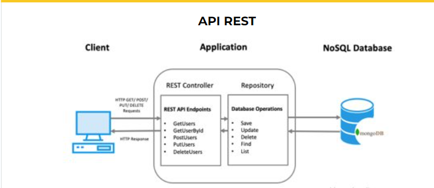

#Clase 15

Java Spring Framework (Spring Framework) es una popular estructura empresarial de código abierto para crear aplicaciones independientes de nivel de producción que se ejecutan en la máquina virtual Java (JVM).

Java Spring Boot (Spring Boot) es una herramienta que hace que el desarrollo de aplicaciones web y microservicios con Spring Framework sea más rápido y fácil a través de tres funcionalidades principales:

- Configuración automática

- Un enfoque obstinado de la configuración

- La capacidad de crear aplicaciones independientes

Estas características funcionan juntas para brindarle una herramienta que le permite configurar una aplicación basada en Spring con una configuración y preparación mínimas.

NOTA: En esta clase vimos como crear y ejecutar un proyecto en spring, utilizando spring initializer(springboot). 

#Clase 16
## API REST & Postman

##Introducción
 
Las API REST sirven para comunicar la información de nuestras aplicaciones, este protocolo es una interfaz que se pone enmedio, un canal de comunicación entre aplicaciones

Como no estamos trabajando con frontend, para poder leer o ver la información que enviamos la haremos mediante postmnan, el cual es un cliente web, que se
va a representar como un navegador

##Api REST

Una API de REST o API de RESTful, es una interfaz de programación de aplicaciones(API o API web) que se ajusta a los limites de arquitectura REST(transferencia
de estado representacional) y permite la interacción con los servicios web de RESTful.

Las API son conjuntos de definiciones y protocolos que se utilizan para diseñar e integrar el software de las aplicaciones. Suele considerarse como el
contrato entre el proveedor de información y el usuario, donde se establece el contenido que se necesita por parte del consumidor(la llamada) y el 
que requiere el productor (la respuesta). 

Por ejemplo, el diseño de una API de servicio meteorológico podria requerir que el usuario escribiera un codigo postal y que el productor diera una respuesta 
en dos partes: la primera seria la temperatura máxima y la segunda, la mínima.

En otras palabras, las API le permiten interacturar con una computadora o un sistema para obtener datos o ejecutar una función, de manera que el sistema
comprenda la solicitud y la cumpla.

##REST

Representacional State Transfer es un ESTILO de arquitectura a la hora de realizar una comunicación entre cliente y servidor.

Habitualmente cuando nosotros realizamos una comunicación cliente servidor accedemos al servidor en un punto de acceso, le enviamos una información
y recibimos un resultado.

Ahora bien, hay muchas formas de realizar esta operación. ¿Cual es la más correcta?. Hoy por hoy una de las necesidades mas claras es que esa comunicación sea
abierta y que podamos acceder desde cualquier sitio. Asi pues, estamos hablando de una comunicación HTTP.
Normalmente, por defecto, usamos el puerto 80 de nuestro servidor para permitir el acceso a la información desde cualquier lugar.

NOTA: Para poder permitir el acceso de otras aplicaciones a la nuestra, existe los cores el cual va a restringir el acceso a la aplicación desde externos.

##Caracteristicas de REST

- *Protocolo cliente/servidor sin estado*: cada petición HTTP contiene toda la información necesaria para ejecutarla, lo que permite que ni cliente 
ni servidor necesiten recordar ningun estado previo para satisfacerla. Aunque esto es asi, algunas aplicaciones HTTP incorporan memoria caché. Se configura
lo que se conoce como protocolo cliente-cache-servidor sin estado: existe la posibilidad de definir algunas respuestas a peticiones HTTP concretas como 
cacheables, con el objetivo de que el cliente pueda ejecutar en un futuro la misma respuesta para peticiones identicas. De todas formas, que exista la
posibilidad no significa que sea lo más recomendable
- Las operaciones mas importantes relacionadas con los datos en cualquier sistema REST y la especificación HTTP son cuatro: POST, GET, PUT y DELETE

- Proporcionar al cliente y al usuario los enlaces adecuados para ejecutar acciones concretas sobre los datos.
- Para cualquier API REST es obligatorio disponer del principio HATEOAS (Hypermedia As The Engine Of Application State – Hipermedia Como Motor del Estado de la Aplicación) para ser una verdadera API REST. Este principio es el que define que cada vez que se hace una petición al servidor y éste devuelve una respuesta, parte de la información que contendrá serán los hipervínculos de navegación asociada a otros recursos del cliente. 

NOTA: Arquitectura monolitica, significa que todos los servicios estan en una misma aplicación

##¿Por qué usar JSON?
Hay varias razones por las que debería considerar usar JSON, la razón principal es que JSON es independiente del lenguaje de programación de su sistema, a pesar de que se deriva de JavaScript. JSON no solo es independiente del lenguaje, sino que también representa datos de elementos comunes de muchos lenguajes de programación, convirtiéndolos efectivamente en una representación de datos universal que todos los sistemas entienden.
Otras razones incluyen:
Legibilidad: JSON es legible por humanos, con el formato adecuado.
Compacidad: el formato de datos JSON no utiliza una estructura de marcado completa, a diferencia de XML.
Es fácil de analizar en componentes sintácticos lógicos, especialmente en JavaScript.
Innumerables bibliotecas JSON están disponibles para la mayoría de los lenguajes de programación.

##Ventajas que ofrece REST para el desarrollo

1.    **Separación entre el cliente y el servidor**: el protocolo REST separa totalmente la interfaz de usuario del servidor y el almacenamiento de datos. Eso tiene algunas ventajas cuando se hacen desarrollos. Por ejemplo, mejora la portabilidad de la interfaz a otro tipo de plataformas, aumenta la escalabilidad de los proyectos y permite que los distintos componentes de los desarrollos se puedan evolucionar de forma independiente.
2.    **Visibilidad, fiabilidad y escalabilidad**. La separación entre cliente y servidor tiene una ventaja evidente y es que cualquier equipo de desarrollo puede escalar el producto sin excesivos problemas. Se puede migrar a otros servidores o realizar todo tipo de cambios en la base de datos, siempre y cuando los datos de cada una de las peticiones se envíen de forma correcta. Esta separación facilita tener en servidores distintos el front y el back y eso convierte a las aplicaciones en productos más flexibles a la hora de trabajar.

3. **La API REST siempre es independiente del tipo de plataformas o lenguajes**: la API REST siempre se adapta al tipo de sintaxis o plataformas con las que se estén trabajando, lo que ofrece una gran libertad a la hora de cambiar o probar nuevos entornos dentro del desarrollo. Con una API REST se pueden tener servidores PHP, Java, Python o Node.js. Lo único que es indispensable es que las respuestas a las peticiones se hagan siempre en el lenguaje de intercambio de información usado, normalmente XML o JSON.

---

##Postman

Postman en sus inicios nace como una extensión que podía ser utilizada en el navegador Chrome de Google y básicamente nos permite realizar peticiones de una manera simple para testear APIs de tipo REST propias o de terceros.Gracias a los avances tecnológicos, Postman ha evolucionado y ha pasado de ser de una extensión a una aplicación que dispone de herramientas nativas para diversos sistemas operativos como lo son Windows, Mac y Linux.

##¿Qué es POSTMAN?

Se trata de una herramienta dirigida a desarrolladores web que permite realizar peticiones HTTP a cualquier API. Postman es muy útil a la hora de programar y hacer pruebas, puesto que nos ofrece la posibilidad de comprobar el correcto funcionamiento de nuestros desarrollos.

Con esto no queremos decir que Postman sea una herramienta exclusiva para profesionales del entorno web, de hecho va a ser muy útil para todo aquel que tenga que interactuar con una API.

##¿Para qué sirve Postman?

Postman sirve para múltiples tareas dentro de las cuales destacaremos en esta oportunidad las siguientes:
Testear colecciones o catálogos de APIs tanto para Frontend como para Backend.
Organizar en carpetas, funcionalidades y módulos los servicios web.
Permite gestionar el ciclo de vida (conceptualización y definición, desarrollo, monitoreo y mantenimiento) de nuestra API.
Generar documentación de nuestras APIs.
Trabajar con entornos (calidad, desarrollo, producción) y de este modo es posible compartir a través de un entorno cloud la información con el resto del equipo involucrado en el desarrollo.

##Métodos más usados y Errores frecuentes
Postman cuenta con una serie de métodos que nos permiten tomar acción ante nuestras peticiones, a continuación, te dejamos los más utilizados:
- **GET**: Obtener información
- **POST**: Agregar información
- **PUT**: Reemplazar la información
- **PATCH**: Actualizar alguna información
- **DELETE**: Borrar información

En cuanto a los posibles errores que podemos apreciar en la respuesta que nos ofrece la herramienta, lo resumiremos en que si la respuesta dada se encuentra en el rango de “200” quiere decir que toda la petición ha salido sin inconvenientes; mientras que el rango de los códigos de error “400” hacen referencia a errores con el cliente y aquellos errores en la línea de los “500” tienen que ver con fallos en el servidor.
