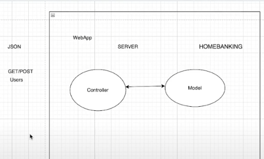
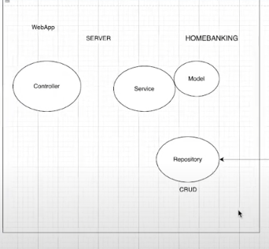
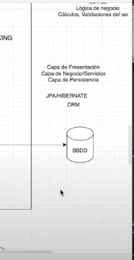
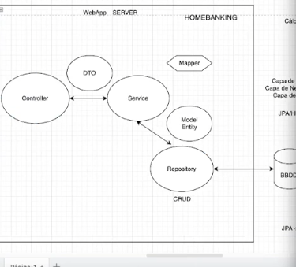
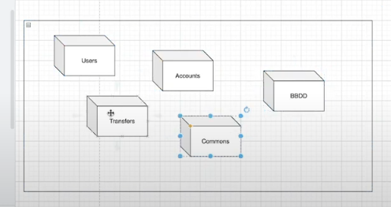

#Clase 17

Nuestra aplicación sera una app web con spring boot 

##¿Como estará estructurado nuestro proyecto final?

Vamos a iniciar nuestro proyecto con un modelo MVC

##MVC

Modelo-vista-controlador
Es un principio de arquitectura de modelado de desarrollo de software el cual dividimos en capas nuestra aplicación.
Viene a representar las capas que tiene el servidor.

En nuestro proyecto la vista queda en el lado del cliente, no va a estar del lado del servidor. Nosotros solo
trabajaremos con el lado del servidor realizando el modelo y el controlador.

El controlador va a ser el encargado de recibir todas las peticiones externas de las vistas por ej., y la va a
distribuir a los recursos.

Nuestros recursos en nuestro proyecto son los: Users/Accounts/Transfers

Los datos y la información de cada uno de nuestros recursos se encuentra en el modelo. 
El modelo representa la clase java(en este caso) de la entidad. Representa el modelo de negocio (entidades, recursos).

Por cada uno de nuestro recursos vamos a tener un controlador y un modelo.
Porque el controlador va a recibir la request, esa request va a depender del tipo de modelo con el que este
trabajando, con el recurso que haya solicitado el cliente, se va a trabajar en el modelo de negocio, se devuelve la
respuesta al controlador, que lo va a trabajar en un formato que entienda la vista, va a trabajar con el mismo formato
que recibio la request (formato JSON). Por lo tanto el controlador va a recibir un JSON, pero lo tiene que transformar
en un modelo

El cliente-servidor se va a comunicar mediante el protocolo HTTP, el cual es nuestro canal de comunicación
principal.

En nuestro proyecto no vamos a trabajar con el modelo MVC. Vamos a ver diferentes niveles arquitectonicos, mediante los
cuales vamos a trabajar con nuestro proyecto. Hasta ahora trabajamos con la base del modelo MVC pero vamos a pasar hacia
un modelo llamado N-LAYERS (n-capas).

Por ahora vamos agregar 2 capas más: Service y Repository.

* Service: Validaciones de otro tipo(si email del usuario ya existe, etc), logica del negocio, cálculos.
* Repository: Encargada del CRUD, puerta de entrada a mi base de datos.

* Controller: Validaciones de caracteres, de textos, todo lo que tenga que ver con el front, para no permitir caracteres
especiales, etc. 

1. Capa de presentación
2. Capa de negocio/servicios
3. Capa de persistencia

 

43:26

Hibernate es un framework de java, una herramienta de mapeo objeto-relacional(ORM)

NOTA:
* Un Java Bean es un estandar que hace referencia a la definición de clases de negocio con
unos requisitos concretos.
* Un Controller es una clase que es responsable de preparar los datos que serán mostrados por la vista así como 
seleccionar la vista correcta a mostrar.

No toda la información que recibimos es buena, ya que atacantes mediante una url, un formulario, etc. Puede inyectar
codigo malicioso para que pasen todas las capas y llegue a la base de datos. Ya que lo que les interesa es la BDD donde
se encuentra toda la información de los usuarios, datos sensibles, etc. Entonces para no tener que trabajar con los mismos
datos de la BDD en puro, lo que existe es un patrón que nos permite separar en una capa más.

Vamos a separar la lógica de negocio de lo que es la lógica de persistencia.
DTO(Data Transfer Object): copiar lo datos de un objeto, en este caso del objeto que vamos a recibir en formato JSON,
para armar una estructura de un objeto parcial.

Mapper: mapeador que va a convertir un objeto a otro. Por ej. UserDTO a User o viceversa

Arquitectura o Sistema Monolitico: El proyecto esta constituido en "un solo contexto". Se siguen usando pero ya esta 
siendo obsoleto para aplicaciones escalables.

Otros tipos de arquitectura: SOA, Microservicios(MS), Hexagonal, el cual son de tipo Clean Architecture

Se puede separar por servicios(SOA). Todos se van tener que interconectar en un mismo contexto, por ej. en la nube.
Si alguno falla, el resto tiene que seguir andando.

