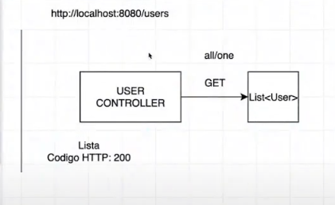

# Clase 18

DTO: es una formato, no una capa. 

Va a ser lo que va a recibir el service del controlador y lo que va a devolver el service al controlador. 
El mapeador va a convertir ese DTO a una entidad lo va a enviar del service al repository.

El repository va a trabajar con una entidad para crear la tabla en la BDD, o para insertar un objeto nuevo a esa tabla.

Vamos arrancar a codificar en el user controller:

* Nuestros repository's son interfaces, y las mismas no se pueden instanciar, pero lo que hace el framework es generar
una clase que implemente la interfaz Repository y a esa implementación es la que instancio en la service(por ej. UserService).

